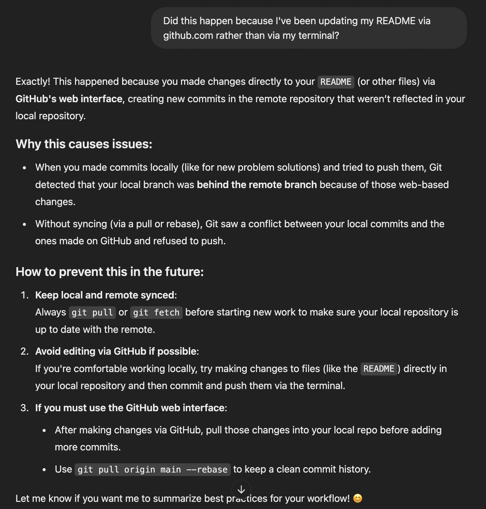
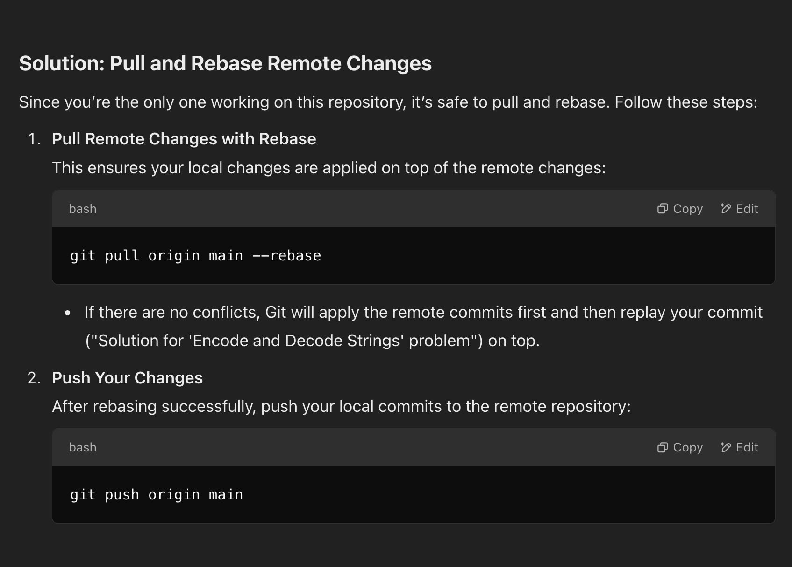

<!DOCTYPE html>
<html>
<body>	
<h1 align="center"> My Git Tutorial Notes </h1>
<h3>1. Navigate to Your Local Repository</h3>

Open your terminal and navigate to the root directory of your local repository:

<pre><code>
cd ~/Documents/leetcode-solutions/leetcode-solutions
</code></pre>
<h3>2. Add the New File to Git</h3>

Use the git add command to stage the new file:

<pre><code>
git add Arrays-and-Hashing/Easy/remove_element.py
</code></pre>
<h3>3. Commit the Changes</h3>

Write a commit message describing the changes:

<pre><code>
git commit -m "Solution for 'Remove Element' problem"
</code></pre>
<h3>4. Push the Changes to GitHub</h3>

Push the changes to the remote repository on GitHub:

<pre><code>
git push origin main
</code></pre>
<h3>5. Verify on GitHub</h3>

Visit your GitHub repository in your browser to confirm that remove_element.py has been added under the correct directory.

Example:

input: <pre><code>ls</code></pre>

input: <pre><code>cd Documents</code></pre>

input: <pre><code>ls</code></pre>

input: <pre><code>cd leetcode-solutions</code></pre>

input: <pre><code>ls</code></pre>

input: <pre><code>cd leetcode-solutions</code></pre>

input: <pre><code>ls</code></pre>
output:  Arrays-and-Hashing

input: <pre><code>ls -a</code></pre>
output:  .			..			.git			Arrays-and-Hashing

input: <pre><code>git add Arrays-and-Hashing/Easy/remove_element.py</code></pre>

input: <pre><code>git commit -m "Solution for 'Remove Element' problem"</code></pre>
output: [main] Solution for 'Remove Element' problem  
1 file changed, 64 insertions(+)  
create mode 100644 Arrays-and-Hashing/Easy/remove_element.py

input: <pre><code>git push origin main</code></pre>
output:  Enter passphrase for key '/Users/___________________/.ssh/id_xxxxxxx': 

If it appears that multiple changes were mistakenly grouped under the same commit in your GitHub repository, and you need to split these into separate commits under unique messages follow the steps sequentaily below.
E.g.: The current interactive rebase (git rebase -i HEAD~3) does not show all the files or commits you expect, suggesting that some changes might have been squashed or merged together in the history.

If there are multiple commits with the same commit message: 
<h3>1. Start Interactive Rebase for Commit to Split:</h3>

Since the files you mentioned are all part of the commit d58bebc (the last one in your git rebase -i HEAD~3 list), start by rebasing to that point:

<pre><code>
git rebase -i HEAD\~3
</code></pre>

<h3>2. Mark the Commit to Edit: In the editor that opens, change the word 'pick' to 'edit' for the commit where the changes are grouped (e.g., d58bebc):</h3>
	
Save and close the editor:  
		Press Ctrl + O  
		Press Enter  
		Press Ctrl + X 

<h3>3. Unstage the Changes: After Git pauses the rebase, unstage all the changes in the selected commit: </h3>

This will leave the changes from d58bebc in your working directory without committing them. 

<pre><code>
git reset HEAD^
</code></pre>
		

<h3>4. Commit Each File Separately: For each file, create a new commit with the correct message.   For example: </h3>
<pre><code>
git add roman_to_integer.py
</code></pre>
<pre><code>
git commit -m "Solution for 'Roman to Integer' problem"
</code></pre>
<pre><code>
git add remove_element.py
</code></pre>
<pre><code>
git commit -m "Solution for 'Remove Element' problem"
</code></pre> 
<pre><code>
git add remove_duplicates.py
</code></pre>
<pre><code>
git commit -m "Solution for 'Remove Duplicates' problem"
</code></pre>

<h3>5. Continue the Rebase: Once you've created separate commits for each file, continue the rebase: </h3>
<pre><code>
git rebase --continue
</code></pre>

<h3>6. Force Push the Updated History: Since this rewrites commit history, force push to update the remote repository: </h3>
<pre><code>
git push --force</code></pre>
<h3>Summary:</h3>
<h4>Why This Works?</h4>

<h5>This process effectively splits the combined commit (d58bebc) into multiple smaller commits, each associated with the specific file and a unique commit message. By doing this, your GitHub repository will reflect the correct history where each file has its own descriptive commit.</h5>

<h1 align="center"> Solution if Updating Repository  via GitHub Interface and Terminal </h1>

<h1 align="center"> Solution if Add, Commit, Push is Rejected </h1>

<b> Error Message Output: </b> 

	 ! [rejected]        main -> main (fetch first) 
error: failed to push some refs to 'github.com:CompSciJosh/leetcode-solutions.git' 
hint: Updates were rejected because the remote contains work that you do 
hint: not have locally. This is usually caused by another repository pushing 
hint: to the same ref. You may want to first integrate the remote changes 
hint: (e.g., 'git pull ...') before pushing again. 
hint: See the 'Note about fast-forwards' in 'git push --help' for details. 

 

<b>Solution:</b>  

</body>
</html>

